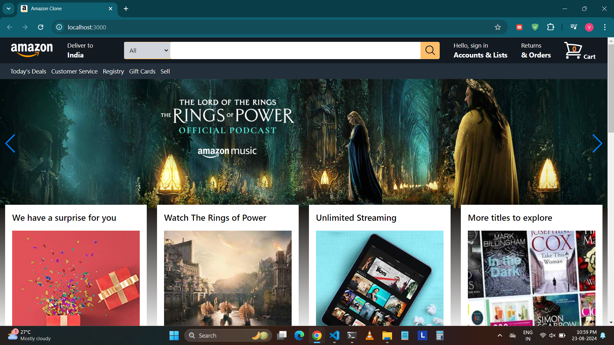
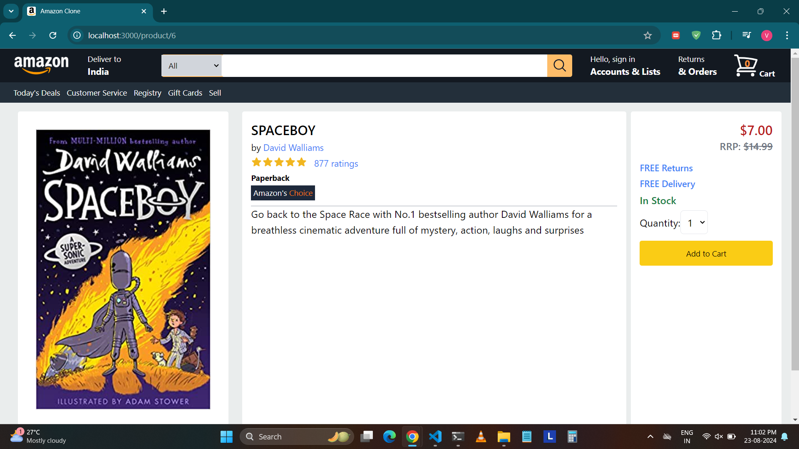
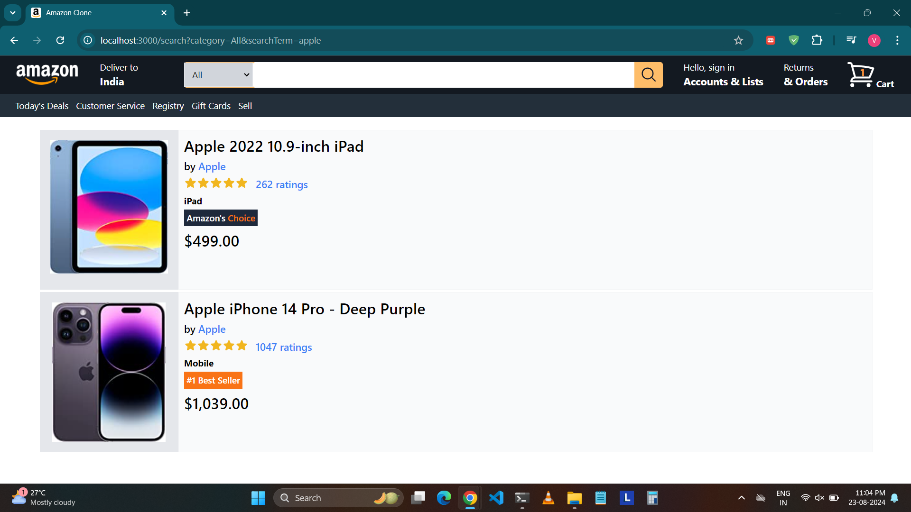
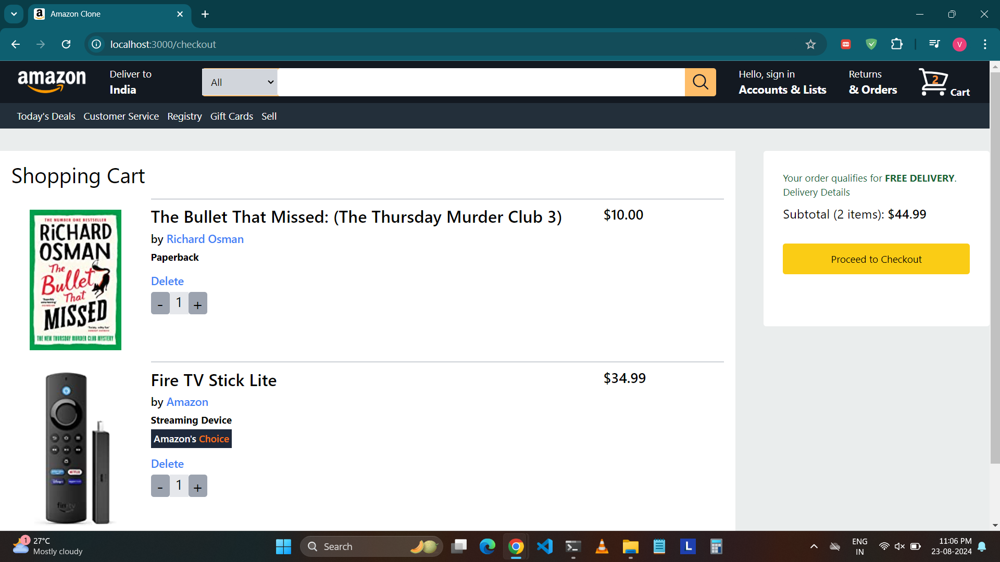

# Amazon.com UI Clone
A clone of the Amazon.com user interface built using React.js, featuring modular components for easier maintenance and improved readability.

## Technologies Used
- React.js
- Redux (for cart state management)
- Tailwind CSS
- Heroicons
- Swiper (for carousel)
- React Router DOM (for navigation)

## Features
- **Modular Design:** Each component is designed modularly to facilitate easy changes and enhance readability.
- **Redux State Management:** Utilizes Redux for managing the state of the shopping cart.
- **Tailwind CSS:** Styling is done using Tailwind CSS, enabling rapid UI development.
- **Heroicons:** Icons from Heroicons library are used in the UI.
- **Swiper Carousel:** The application uses swiper carousel for carousel implementations.
- **React Router DOM:** Implements React Router DOM for seamless navigation between different pages of the application.

## Screenshots

### Landing Page

### Products Page

### Search Results

### Cart

